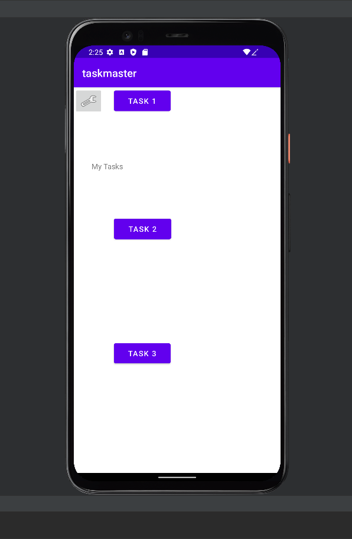

# TaskMaster

## Description
- TaskMaster is an Android app that allows users to keep track of their tasks.

## Change Log
- 3/21:
    - Added three basic activity pages: designed general layout and Intent to move between pages
    - Screenshots:
      
      
      
      
- 3/22: 
    - Changed home page of app: now has three different task buttons, each leading to a task details activity. 
    - Data is passed from the home screen to each Task Details instance.
    - Added a settings activity which is accessible from the home screen. The user can save a username which is referencable through out the rest of the app via Shared preferences
    - Screenshots:
      
      
      
