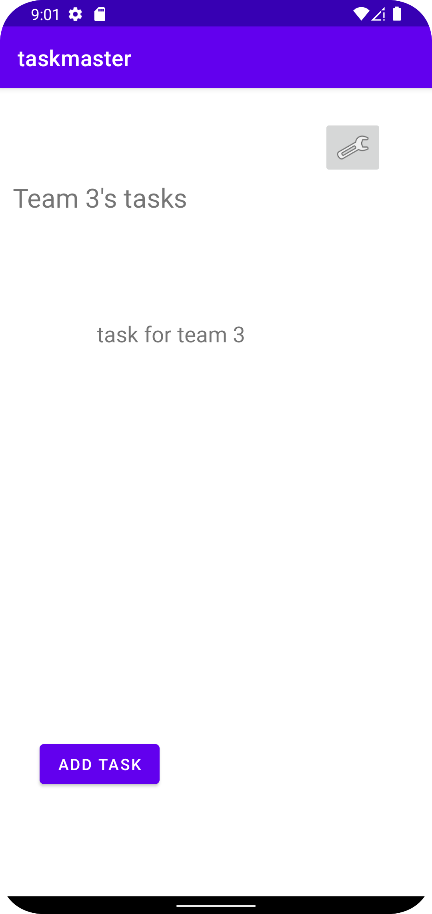

# TaskMaster

## Description
- TaskMaster is an Android app that allows users to keep track of their tasks.

## Change Log
- 3/21:
    - Added three basic activity pages: designed general layout and Intent to move between pages
    - Screenshots:
      
      
      
      
- 3/22: 
    - Changed home page of app: now has three different task buttons, each leading to a task details activity. 
    - Data is passed from the home screen to each Task Details instance.
    - Added a settings activity which is accessible from the home screen. The user can save a username which is referencable through out the rest of the app via Shared preferences
    - Screenshots:
      
      
      
- 3/23: 
    - Changed home page of app: now has a recycler view list of tasks which are currently hard coded in.
    - Each task on the recycler list takes the user to the Task Details activity, passing the name of the task
    - Added a Task object with an enum property to represent the completion status of tasks
    - Screenshots:
     
      
- 3/24:
    - Added sqlite database to persist data
    
- 3/29:
    - Removed Room DB and added AWS amplify
    
- 3/31:
    - Added team model with appropriate relationship to task models
    
-4/5: 
    - Added team spinner in both settings and task creation activities to allow users to select a particular team to both filter and assign tasks.
    
-4/8:
    - Added AWS cognito for user authentication
    - Users can: signup, verify their email, and login to exists accounts
    
-4/10:
    - Added AWS S3 for image storing; Users can add can image to a task during creation
    - task image shows in the task details activity:
    
-4/11: 
    - Added external calling intent to allow users to open the taskmaster app from another app
    - When opened from another app, the taskmaster app will have automatically populated task file image field
-4/12:
    - Added AWS analytics
    - Added AWS text to speech functionality
    - Added AWS translate functionality
    
    